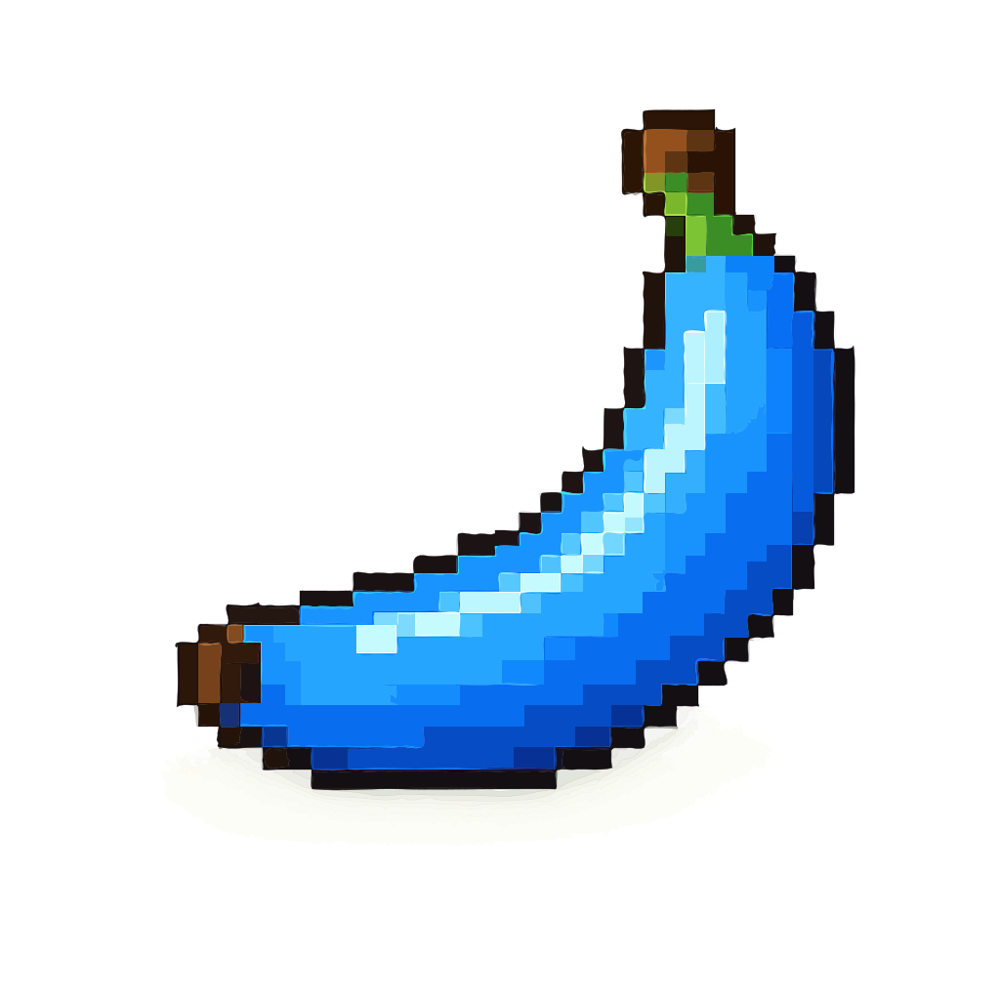

# Banana Pixel Club

Яркий статический сайт о бананах, сортах, пользе и тропическом настроении. Проект выполнен как многостраничная верстка с адаптивом, анимациями, SVG-иллюстрациями и CSS-структурой по методологии БЭМ.

## Страницы

- `index.html` - главная страница с hero-блоком, фактами, витриной сортов, отзывом и формой подписки.
- `bananas.html` - каталог сортов бананов с карточками и описаниями.
- `contacts.html` - контактная страница с формой обратной связи, ссылками и соцсетями.

## Технологии

- HTML5
- CSS3
- JavaScript
- БЭМ для именования классов
- SVG-графика
- Адаптивная верстка

## Структура проекта

```text
.
├── index.html
├── bananas.html
├── contacts.html
├── css/
│   ├── style.css
│   ├── base/
│   │   ├── variables.css
│   │   ├── reset.css
│   │   └── animations.css
│   ├── blocks/
│   │   ├── background.css
│   │   ├── header.css
│   │   ├── section.css
│   │   ├── button.css
│   │   ├── glass-card.css
│   │   ├── banana-card.css
│   │   ├── form.css
│   │   └── footer.css
│   └── pages/
│       ├── home.css
│       ├── catalog.css
│       ├── contacts.css
│       └── adaptive.css
├── images/
│   ├── banana/
│   └── monkey/
└── js/
    └── main.js
```

## CSS-архитектура

Главный файл `css/style.css` подключает остальные CSS-модули через `@import`.

- `base/` - переменные, базовые сбросы, общие анимации.
- `blocks/` - независимые БЭМ-блоки: шапка, кнопки, формы, карточки, футер.
- `pages/` - стили конкретных страниц и адаптивные правила.

Пример БЭМ-именования:

```html
<article class="banana-card banana-card--showcase">
  
  <div class="banana-card__body">
    <h3 class="banana-card__title">Cavendish</h3>
    <p class="banana-card__text">Классический сладкий сорт.</p>
  </div>
</article>
```

## JavaScript

Файл `js/main.js` отвечает за:

- мобильное меню;
- изменение шапки при скролле;
- появление элементов при прокрутке;
- легкий parallax-эффект;
- обработку форм без отправки на сервер;
- интерактивное нажатие карточек фактов.

## Как запустить

Проект не требует сборки и зависимостей. Достаточно открыть файл:

```text
index.html
```

Также можно запустить локальный сервер любым удобным способом, например через Live Server в редакторе.

## Особенности

- Все SVG лежат в тематических подпапках `images/banana/` и `images/monkey/`.
- Верстка адаптирована под мобильные, планшетные и desktop-экраны.
- Компоненты стилизованы независимо и переиспользуются на разных страницах.
- Витринные карточки используют БЭМ-модификатор `banana-card--showcase`.

